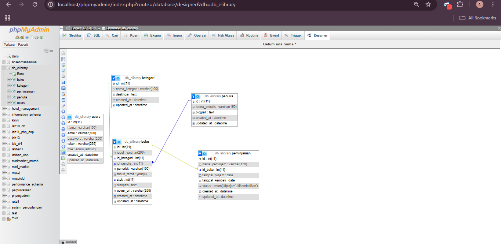
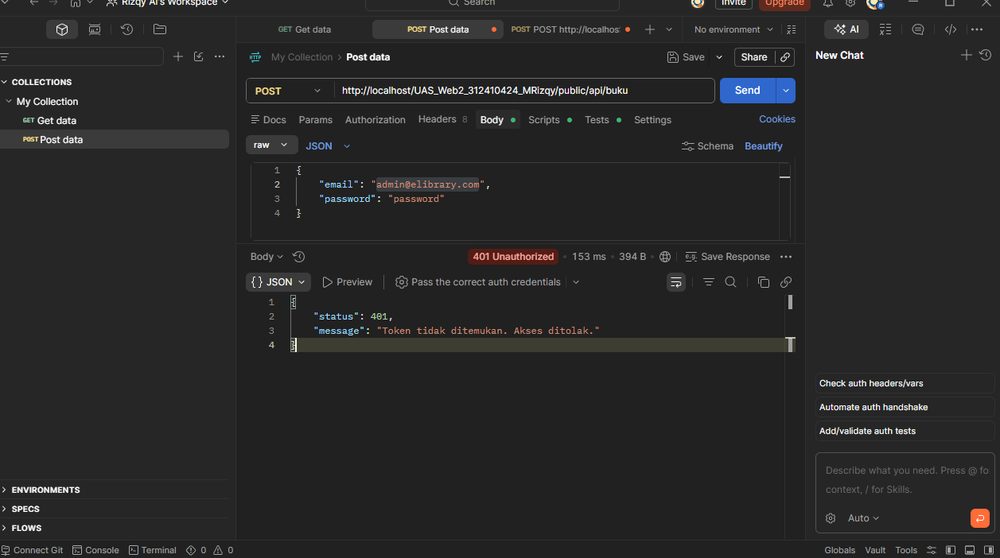
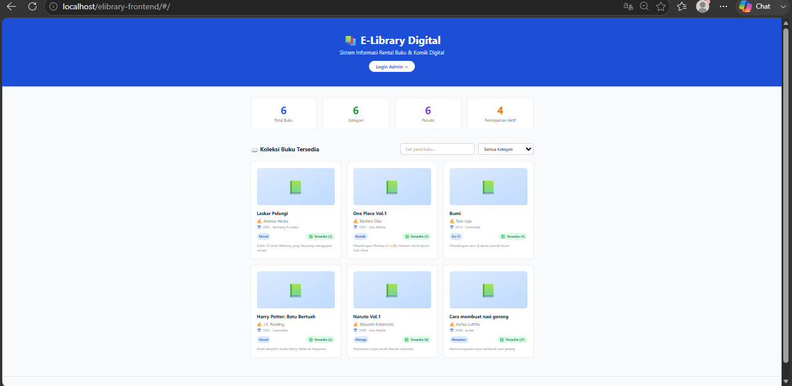
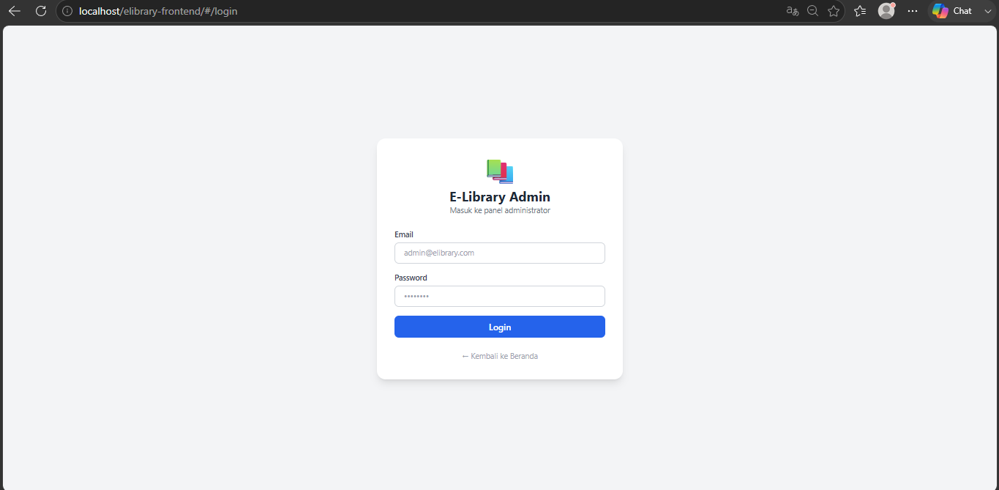
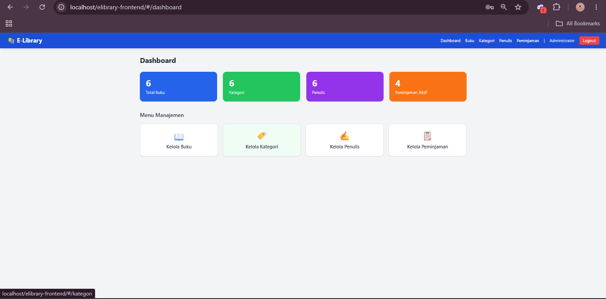
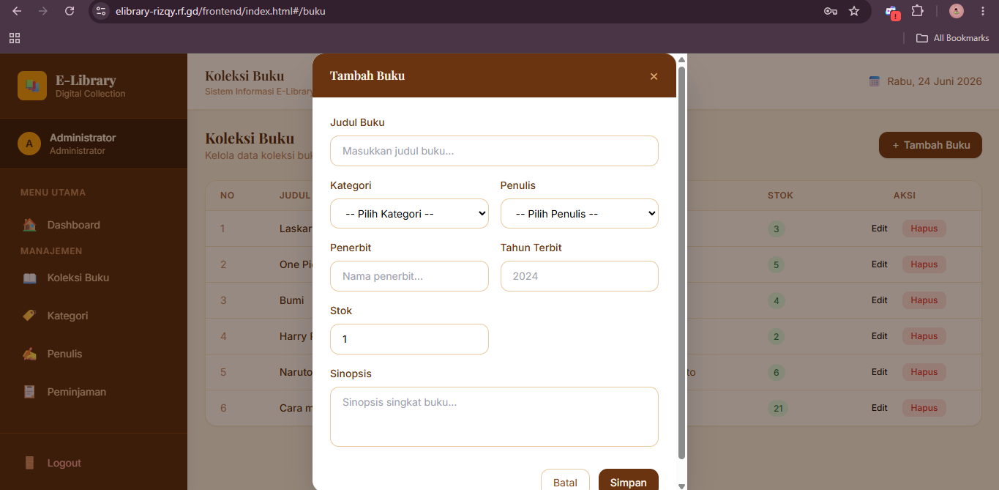

# 📚 E-Library Digital — Sistem Informasi Rental Buku & Komik Digital
```
**UAS Pemrograman Web 2**
Nama: M. Rizqy Al Rasyd
NIM: 312410424
Kelas: I241C
Tema: Sistem Informasi Rental Buku / Komik Digital (E-Library)
```

---

## 📌 Deskripsi Proyek

E-Library Digital adalah aplikasi web berbasis **Decoupled Architecture** yang memisahkan sepenuhnya antara Backend API dan Frontend SPA. Aplikasi ini berfungsi sebagai sistem manajemen rental buku dan komik digital yang memiliki dua level akses:

- **Pengunjung (Public)** — Dapat melihat koleksi buku yang tersedia, statistik koleksi, serta melakukan pencarian dan filter buku berdasarkan kategori tanpa perlu login.
- **Administrator** — Dapat mengelola seluruh data master (buku, kategori, penulis, peminjaman) melalui panel admin yang dilindungi sistem autentikasi Bearer Token.

---

## 🛠️ Teknologi yang Digunakan

| Layer | Teknologi |
|---|---|
| Backend | PHP — CodeIgniter 4 (REST API) |
| Frontend | Vue.js 3 (CDN) + Vue Router 4 |
| UI Framework | TailwindCSS (CDN) |
| HTTP Client | Axios |
| Database | MySQL / MariaDB (XAMPP) |
| Auth | Bearer Token (disimpan di localStorage) |

---

## 🗂️ Struktur Repositori

```
UAS_Web2_312410424_MRizqy/
├── backend-api/                  ← CodeIgniter 4 REST API
│   ├── app/
│   │   ├── Controllers/
│   │   │   ├── AuthController.php
│   │   │   ├── BukuController.php
│   │   │   ├── KategoriController.php
│   │   │   ├── PenulisController.php
│   │   │   └── PeminjamanController.php
│   │   ├── Models/
│   │   │   ├── UserModel.php
│   │   │   ├── BukuModel.php
│   │   │   ├── KategoriModel.php
│   │   │   ├── PenulisModel.php
│   │   │   └── PeminjamanModel.php
│   │   ├── Filters/
│   │   │   ├── AuthFilter.php
│   │   │   └── CorsFilter.php
│   │   └── Config/
│   │       ├── Filters.php
│   │       └── Routes.php
│   └── ...
└── frontend-spa/                 ← Vue.js 3 SPA
    ├── index.html
    └── assets/
        └── js/
            ├── app.js
            ├── router.js
            └── components/
                ├── Home.js
                ├── Login.js
                ├── Dashboard.js
                ├── Buku.js
                ├── Kategori.js
                ├── Penulis.js
                └── Peminjaman.js
```

---

## 🗄️ Skema Relasi Database

> **Screenshot ERD dari phpMyAdmin Designer:**



### Daftar Tabel

| Tabel | Keterangan |
|---|---|
| `users` | Data akun administrator |
| `kategori` | Kategori / genre buku |
| `penulis` | Data penulis buku |
| `buku` | Data koleksi buku (FK ke kategori & penulis) |
| `peminjaman` | Data transaksi peminjaman (FK ke buku) |

### Relasi Antar Tabel
- `buku.id_kategori` → `kategori.id` (Many to One)
- `buku.id_penulis` → `penulis.id` (Many to One)
- `peminjaman.id_buku` → `buku.id` (Many to One)

---

## 🔐 Sistem Autentikasi & Keamanan API

### Alur Login
1. Frontend kirim `POST /api/auth/login` dengan email & password via Axios
2. Backend validasi kredensial, generate Bearer Token acak (`bin2hex(random_bytes(32))`)
3. Token disimpan di tabel `users` dan dikembalikan ke frontend
4. Frontend simpan token di `localStorage` browser
5. Setiap request berikutnya, Axios Interceptor otomatis menyisipkan token di header `Authorization: Bearer {token}`

### Proteksi Endpoint
Endpoint manipulasi data (POST, PUT, DELETE) dilindungi oleh `AuthFilter` CI4:

```
Authorization: Bearer {token}
```

### Screenshot Uji Coba API Gagal (Error 401)

> Request tanpa token ke endpoint yang dilindungi:



---

## 🖥️ Tampilan Antarmuka Aplikasi

### Halaman Beranda (Public — Tanpa Login)
> Pengunjung dapat melihat statistik koleksi dan daftar buku lengkap dengan fitur pencarian dan filter kategori.



### Halaman Login
> Form login administrator dengan validasi email dan password.



### Halaman Dashboard Admin
> Ringkasan statistik data setelah berhasil login.



### Form Modal Tambah / Edit Data
> Modal interaktif untuk menambah dan mengedit data buku.



---

## 📡 Daftar Endpoint API

### Auth
| Method | Endpoint | Auth | Keterangan |
|---|---|---|---|
| POST | `/api/auth/login` | ❌ | Login admin |
| POST | `/api/auth/logout` | ✅ | Logout admin |

### Buku
| Method | Endpoint | Auth | Keterangan |
|---|---|---|---|
| GET | `/api/buku` | ❌ | Ambil semua buku |
| GET | `/api/buku/{id}` | ❌ | Ambil buku by ID |
| POST | `/api/buku` | ✅ | Tambah buku |
| PUT | `/api/buku/{id}` | ✅ | Edit buku |
| DELETE | `/api/buku/{id}` | ✅ | Hapus buku |

### Kategori
| Method | Endpoint | Auth | Keterangan |
|---|---|---|---|
| GET | `/api/kategori` | ❌ | Ambil semua kategori |
| GET | `/api/kategori/{id}` | ❌ | Ambil kategori by ID |
| POST | `/api/kategori` | ✅ | Tambah kategori |
| PUT | `/api/kategori/{id}` | ✅ | Edit kategori |
| DELETE | `/api/kategori/{id}` | ✅ | Hapus kategori |

### Penulis
| Method | Endpoint | Auth | Keterangan |
|---|---|---|---|
| GET | `/api/penulis` | ❌ | Ambil semua penulis |
| GET | `/api/penulis/{id}` | ❌ | Ambil penulis by ID |
| POST | `/api/penulis` | ✅ | Tambah penulis |
| PUT | `/api/penulis/{id}` | ✅ | Edit penulis |
| DELETE | `/api/penulis/{id}` | ✅ | Hapus penulis |

### Peminjaman
| Method | Endpoint | Auth | Keterangan |
|---|---|---|---|
| GET | `/api/peminjaman` | ❌ | Ambil semua peminjaman |
| POST | `/api/peminjaman` | ✅ | Tambah peminjaman |
| PUT | `/api/peminjaman/{id}` | ✅ | Edit peminjaman |
| DELETE | `/api/peminjaman/{id}` | ✅ | Hapus peminjaman |

---

## ⚙️ Petunjuk Instalasi & Menjalankan Proyek

### Prasyarat
- XAMPP (PHP 8.x + MySQL)
- Composer
- Browser modern

### 1. Clone Repositori

```bash
git clone https://github.com/USERNAME/UAS_Web2_312410424_MRizqy.git
cd UAS_Web2_312410424_MRizqy
```

### 2. Setup Backend (CI4)

```bash
cd backend-api
composer install
cp env .env
```

Edit file `.env`:

```env
CI_ENVIRONMENT = development
app.baseURL = 'http://localhost/UAS_Web2_312410424_MRizqy/backend-api/public/'

database.default.hostname = localhost
database.default.database = db_elibrary
database.default.username = root
database.default.password =
database.default.DBDriver = MySQLi
database.default.port = 3306
```

### 3. Setup Database

- Buka phpMyAdmin: `http://localhost/phpmyadmin`
- Buat database baru: `db_elibrary`
- Import file SQL: `backend-api/db_elibrary.sql`

### 4. Jalankan Frontend

- Pastikan XAMPP Apache sudah running
- Buka browser, akses:

```
http://localhost/UAS_Web2_312410424_MRizqy/frontend-spa/
```

### 5. Akun Default Admin

| Field | Value |
|---|---|
| Email | `admin@elibrary.com` |
| Password | `password` |

---

## 🔗 Link Demo & Presentasi

| | Link |
|---|---|
| 🌐 Demo Aplikasi | `http://localhost/elibrary-frontend/` (lokal) |
| 🎥 Video Presentasi | [YouTube — klik di sini](https://youtube.com/LINK_VIDEO_KAMU) |
| 💻 Repositori GitHub | [github.com/USERNAME/UAS_Web2_312410424_MRizqy](https://github.com/USERNAME/UAS_Web2_312410424_MRizqy) |

---

## 👤 Identitas Mahasiswa

| | |
|---|---|
| **Nama** | M. Rizqy Al Rasyd |
| **NIM** | 312410424 |
| **Mata Kuliah** | Pemrograman Web 2 |
---
